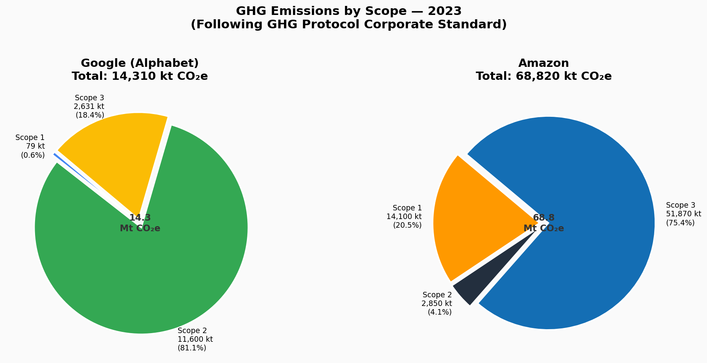
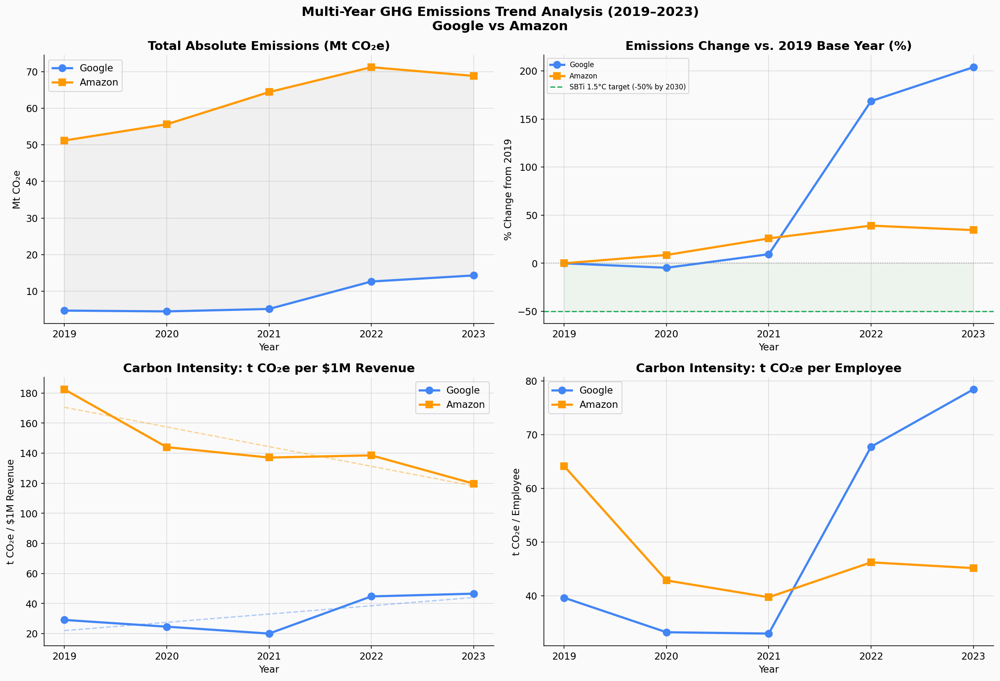

# Corporate GHG Accounting & Emissions Intensity Analysis

This repository contains an analysis of Greenhouse Gas (GHG) emissions for companies like Google and Amazon, based on their sustainability reports (2019-2023). It includes data processing, visualizations, trend analysis, and interactive charts.

## Overview
- **Objectives**: Load multi-year GHG data, calculate emissions factors, visualize scopes, trends, and more.
- **Tools Used**: Python (Pandas, Matplotlib/Seaborn, etc.) in Google Colab.
- **Key Sections**: Setup, Emission Factors, Corporate Data, Visualizations, Trend Analysis, Interactive Elements, Summary Stats.

## How to Run Interactively
Click the badge below to open in Google Colab for full interactivity (e.g., hover over charts, zoom, etc.):

(If you already included the link when saving from Colab, this badge is auto-added to the notebook—feel free to copy it here too.)

## Sample Visualizations
Here are some static exports from the analysis:

For more, open the notebook in Colab.

## Data Sources
- Exported CSVs in `/data` folder (e.g., google_ghg_2019_2023.csv).
- Original reports: Google/Amazon Environmental Sustainability Reports (2019-2023).

## Setup Instructions
1. Open in Colab via the link above.
2. Run all cells to regenerate data and charts.
3. Exports will save to /data and /images (temporarily in the runtime).

Feel free to reach out for questions!
